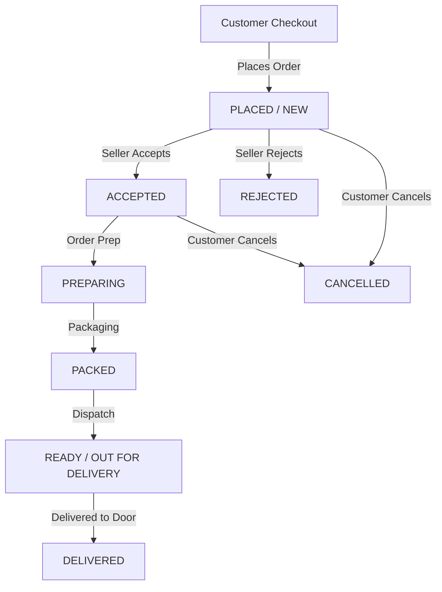

# 🏪 Ghareludukan (घरेलूदुकान)
> **Your Gully, Your Dukan, Online** — A modern hyperlocal neighborhood commerce web platform connecting neighborhood shoppers with local stores and empowering gully shop owners with a digital retail management system.

[](https://reactjs.org/)
[](https://vitejs.dev/)
[](https://tailwindcss.com/)
[](LICENSE)

---

## 📖 Table of Contents
1. [Platform Overview](#-platform-overview)
2. [Source Code (`src/`) Architecture & Modules](#-source-code-src-architecture--modules)
   - [Root Application Level](#1-root-application-level)
   - [Authentication Module (`src/components/auth/`)](#2-authentication-module-srccomponentsauth)
   - [Customer Portal (`src/components/customer/`)](#3-customer-portal-srccomponentscustomer)
   - [Seller / Merchant Dashboard (`src/components/seller/`)](#4-seller--merchant-dashboard-srccomponentsseller)
   - [Marketplace & Shared Components (`src/components/marketplace/` & `common/`)](#5-marketplace--shared-components)
   - [Data Store & Models (`src/data/`)](#6-data-store--mock-database-srcdata)
3. [Order Lifecycle & State Synchronization](#-order-lifecycle--state-synchronization)
4. [Technology Stack](#-technology-stack)
5. [Getting Started & Local Development](#-getting-started--local-development)
6. [Design System & Theming](#-design-system--theming)
7. [Author & Credits](#-author--credits)

---

## 📖 Platform Overview

**Ghareludukan** is engineered to bridge traditional local brick-and-mortar stores with modern hyperlocal digital commerce. Going beyond standard grocery delivery apps, Ghareludukan supports all gully shop types:
- 🎁 **Party Gifts, Toys & Clocks**
- 🍽️ **Daily Essentials, Utensils & Crockery**
- 🎂 **Local Bakery, Sweets & Dairy**
- 💊 **Neighborhood Pharmacy & Healthcare**
- 🧾 **Authentic Khata Bill Paper Ledger Receipts**

---

## 🏛️ Source Code (`src/`) Architecture & Modules

The entire frontend codebase is organized modularly under [`src/`](file:///d:/Working%20file/Ghareludukan/src):

```text
src/
├── components/
│   ├── auth/                  # Unified phone & OTP authentication flow
│   ├── common/                # Shared global UI (Footer, Modals, Toasts)
│   ├── customer/              # Hyperlocal Customer Web Application
│   │   ├── cart/              # Cart drawer & items calculation
│   │   ├── checkout/          # Delivery slot & multi-mode checkout
│   │   ├── home/              # Hero banners, stores & categories feed
│   │   ├── notifications/     # Live read/unread notification center
│   │   ├── orders/            # Orders list & live status timeline
│   │   ├── products/          # Modal product detail & quick adds
│   │   ├── profile/           # User profile, wallet, coupons & address book
│   │   ├── search/            # Keyword search & product filtering
│   │   ├── shops/             # Shop storefronts & in-shop inventory
│   │   ├── support/           # Help center, FAQs & issue tickets
│   │   ├── tracking/          # Step-by-step live delivery visualizer
│   │   ├── wishlist/          # Saved items & favorited stores
│   │   ├── CustomerApp.jsx    # Customer layout coordinator & routing
│   │   ├── CustomerConstants.js # Customer navigation tokens & constants
│   │   ├── CustomerHeader.jsx # Customer header & search triggers
│   │   ├── CustomerSidebar.jsx # Desktop & tablet customer navigation
│   │   └── CustomerBottomNav.jsx # Mobile bottom quick-access bar
│   ├── marketplace/           # Shared commerce components & widgets
│   └── seller/                # Merchant / Shop Owner Management Portal
│       ├── analytics/         # Sales overview, graphs & report generation
│       ├── customers/         # Customer CRM & repeat buyer trends
│       ├── dashboard/         # Live metrics, quick stats & incoming orders
│       ├── inventory/         # Stock toggle & catalog management
│       ├── notifications/     # Merchant alerts & low-stock pings
│       ├── offers/            # Store discount codes & promotional campaigns
│       ├── orders/            # Status pipeline & order processing views
│       ├── products/          # Add new product modal & product catalog
│       ├── profile/           # Store settings, operating hours & bank UPI
│       ├── reviews/           # Customer ratings & feedback moderation
│       ├── settlements/       # Payouts, live ledger & GST tax invoices
│       ├── support/           # Merchant help desk & priority support
│       ├── SellerApp.jsx      # Seller root coordinator & view switcher
│       ├── SellerConstants.js # Seller navigation structure & status tokens
│       ├── SellerHeader.jsx   # Seller header with live shop online toggle
│       └── SellerSidebar.jsx  # Seller sidebar with dynamic badge indicators
├── data/
│   ├── index.js               # Data export aggregator
│   └── mockData.js            # Unified master dataset (orders, shops, items)
├── App.jsx                    # Root state coordinator (Order state & theme)
├── index.css                  # Tailwind styles & design system CSS tokens
└── main.jsx                   # React DOM root entry point
```

---

### 1. Root Application Level

- **[`src/App.jsx`](file:///d:/Working%20file/Ghareludukan/src/App.jsx)**:
  - **Single Source of Truth**: Houses the central `orders` collection synchronized with `localStorage` (`"ghareludukan_orders"`).
  - **Role Dispatcher**: Switches between `Auth`, `CustomerApp`, and `SellerApp` based on authentication state.
  - **Order Lifecycle Dispatcher**: Exposes `handleUpdateOrderStatus` and `handlePlaceOrder` to propagate live order updates across both customer and seller dashboards in real time.
  - **Theme Manager**: Toggles light/dark theme classes on `document.body`.

---

### 2. Authentication Module (`src/components/auth/`)

- **[`Auth.jsx`](file:///d:/Working%20file/Ghareludukan/src/components/auth/Auth.jsx)**: Main login screen with glassmorphic showcase and authentication steps.
- **[`AuthBrandHeader.jsx`](file:///d:/Working%20file/Ghareludukan/src/components/auth/AuthBrandHeader.jsx)**: Brand mark, slogan badge, and sparkling icon indicators.
- **[`RoleSelector.jsx`](file:///d:/Working%20file/Ghareludukan/src/components/auth/RoleSelector.jsx)**: Segmented role switcher between **Customer** (Cyan theme) and **Shop Partner** (Indigo theme).
- **[`PhoneStep.jsx`](file:///d:/Working%20file/Ghareludukan/src/components/auth/PhoneStep.jsx)**: Mobile number entry with automatic validation and role-specific submit buttons.
- **[`OtpStep.jsx`](file:///d:/Working%20file/Ghareludukan/src/components/auth/OtpStep.jsx)**: 4-digit verification code input with resend and phone number edit options.

---

### 3. Customer Portal (`src/components/customer/`)

| Folder / Component | Description |
|---|---|
| **[`CustomerApp.jsx`](file:///d:/Working%20file/Ghareludukan/src/components/customer/CustomerApp.jsx)** | Central customer router, responsive layout manager, and global state coordinator (Cart, Wishlist, Notifications). |
| **`home/CustomerHome.jsx`** | Marketplace landing page with promotional hero banners, trending categories, top-rated nearby stores, and flash deals. |
| **`shops/CustomerShopDetail.jsx`** | Individual store page featuring shop timings, distance, verified badges, category tabs, and product catalog. |
| **`products/CustomerProductDetail.jsx`** | Rich product modal showing image galleries, unit variants, stock status, and add-to-cart controls. |
| **`cart/CustomerCart.jsx`** | Cart overview with itemized bill breakdown, delivery fee calculations, and instant checkout trigger. |
| **`checkout/CustomerCheckout.jsx`** | Checkout flow with saved address selection, delivery scheduling, and payment methods (UPI, Cash, Wallet). |
| **`orders/CustomerOrders.jsx`** | Dynamic orders list filtered by `Active`, `Completed`, and `Cancelled` tabs with real-time status updates. |
| **`orders/CustomerOrderDetail.jsx`** | Detailed view for a single order containing timeline tracking, shop contacts, items list, and cancel request options. |
| **`tracking/CustomerTracking.jsx`** | Visual step-by-step order tracking progress bar with ETA calculations. |
| **`profile/CustomerProfile.jsx`** | Customer account dashboard linking to Addresses, Wallet, Coupons, and Preferences. |
| **`profile/CustomerWallet.jsx`** | Digital cash balance, scratch cards, and cashback transaction history. |
| **`profile/CustomerCoupons.jsx`** | Discount vouchers, seasonal promo codes, and minimum order qualifiers. |
| **`profile/CustomerAddressBook.jsx`** | Manage home, work, and custom delivery addresses with default tags. |
| **`notifications/CustomerNotifications.jsx`** | Filterable notification center (`All`, `Unread`, `Orders`, `Promos`) with mark-as-read actions. |

---

### 4. Seller / Merchant Dashboard (`src/components/seller/`)

| Folder / Component | Description |
|---|---|
| **[`SellerApp.jsx`](file:///d:/Working%20file/Ghareludukan/src/components/seller/SellerApp.jsx)** | Main merchant management shell, active view renderer, and shop online/offline coordinator. |
| **`dashboard/SellerDashboard.jsx`** | High-level summary of today's gross sales, pending new orders, fast actions, and revenue metrics. |
| **`orders/SellerOrders.jsx`** | Complete order processing hub with dynamic status tabs (`New Order`, `Accepted`, `Preparing`, `Packed`, `Ready`, `Delivered`, `Rejected`, `Cancelled`) and live search. |
| **`orders/SellerOrderDetail.jsx`** | Order preparation workspace to adjust prep timers, print receipts, and advance orders through each milestone. |
| **`inventory/SellerInventory.jsx`** | Real-time stock monitor, low-stock alerts, fast in-stock toggle, and price editors. |
| **`products/SellerProducts.jsx`** | Full store product catalog with search, category filtering, and edit triggers. |
| **`products/SellerAddProduct.jsx`** | Modal workflow to list new products with images, units, MRP, and discounted pricing. |
| **`settlements/SellerSettlements.jsx`** | 15-day batch payout summary, net payable balances, commission deductions, and payout history. |
| **`settlements/SellerTransactions.jsx`** | Live ledger of all customer payments, gateway deductions, and net credited amounts. |
| **`settlements/SellerInvoices.jsx`** | Itemized tax invoices with GSTIN details and PDF download capabilities. |
| **`analytics/SellerAnalytics.jsx`** | Business performance charts powered by Recharts (Weekly sales, category shares, peak hours). |
| **`analytics/SellerReports.jsx`** | Downloadable periodic sales summaries and tax breakdown reports. |
| **`customers/SellerCustomers.jsx`** | Repeat buyer analytics, customer order frequency, and top shopper profiles. |
| **`reviews/SellerReviews.jsx`** | Customer ratings, reviews moderation, and seller response management. |
| **`profile/SellerProfile.jsx`** | Store profile details, delivery radiuses, and bank UPI payout settings. |
| **`profile/SellerSettings.jsx`** | Order auto-accept toggles, prep buffer defaults, continuous audio alerts, and WhatsApp invoice receipts. |

---

### 5. Marketplace & Shared Components

- **[`src/components/common/Footer.jsx`](file:///d:/Working%20file/Ghareludukan/src/components/common/Footer.jsx)**: Clean global footer with copyright notices and developer attribution.
- **[`src/components/marketplace/SharedComponents.jsx`](file:///d:/Working%20file/Ghareludukan/src/components/marketplace/SharedComponents.jsx)**: Reusable components including product cards, status badges, price formatters, and quantity steppers.

---

### 6. Data Store & Mock Database (`src/data/`)

- **[`src/data/mockData.js`](file:///d:/Working%20file/Ghareludukan/src/data/mockData.js)**:
  - `MOCK_SHOPS`: Hyperlocal shop entities with coordinates, opening hours, categories, and ratings.
  - `MOCK_PRODUCTS`: Categorized product inventory items with stock levels, units, and tags.
  - `MOCK_ORDERS`: Initial order dataset across all status stages.
  - `MOCK_NOTIFICATIONS`: Multi-category customer and merchant notification logs.
  - `MOCK_SETTLEMENTS` & `MOCK_TRANSACTIONS`: Financial records, payout batches, and GST invoices.

---

## 🔄 Order Lifecycle & State Synchronization



- **Single Master State**: Orders are managed centrally in `App.jsx` and persist to `localStorage`.
- **Dynamic Badge Counts**:
  - **Seller Sidebar**: Strictly shows `PLACED` / `NEW` orders requiring seller action.
  - **Seller Header**: Dynamically counts `{orders.length} total orders · {newOrdersCount} new`.
  - **Customer Sidebar**: Displays clean navigation item without confusing badge numbers.
  - **Customer Orders Tabs**: Dynamically sorts and counts orders into `Active`, `Completed`, and `Cancelled`.

---

## 🛠️ Technology Stack

| Layer | Library / Tool | Purpose |
|---|---|---|
| **Core** | React 18.3.1 | Component-based UI Architecture |
| **Build Tool** | Vite 6.1.0 | Fast HMR & Production Bundling |
| **Styling** | Tailwind CSS 3.4.17 | Utility-first responsive design tokens |
| **Icons** | Lucide React | Modern SVG icons |
| **Charts** | Recharts 2.15.1 | Interactive business analytics & visual reports |
| **Animations** | Framer Motion | Smooth page transitions and micro-interactions |
| **Effects** | Canvas Confetti | Order completion celebrations |

---

## 🚀 Getting Started & Local Development

### 1. Clone & Install
```bash
git clone https://github.com/bhumikajain54/Ghareludukan.git
cd Ghareludukan
npm install
```

### 2. Run Development Server
```bash
npm run dev
```
Navigate to `http://localhost:5173/` in your browser.

### 3. Build for Production
```bash
npm run build
npm run preview
```

---

## 🎨 Design System & Theming

- **Dark & Light Mode**: Seamless theme switching with high-contrast color combinations.
- **Glassmorphism**: Backdrop blur styling (`backdrop-blur-md`, `bg-white/80`, `bg-slate-900/80`).
- **Responsive Layout**: Designed for mobile devices, tablets, and wide desktop displays.

---

## 👩‍💻 Author & Credits

- **Developer & Designer**: [Bhumika Jain](https://github.com/bhumikajain54)
- **Organization**: Yovexa Solutions
- **Repository**: [https://github.com/bhumikajain54/Ghareludukan](https://github.com/bhumikajain54/Ghareludukan)

---

## 📄 License
This project is licensed under the MIT License.